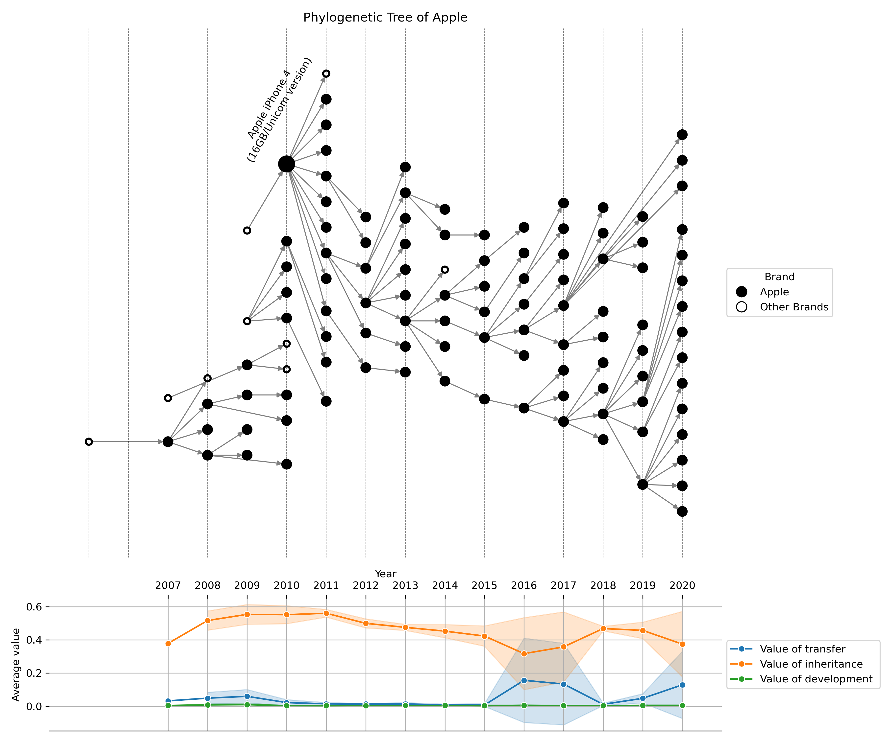

# Paper
Predicting Benchmark Product Potential through Technological Phylogeny and Developmental Strategy Analysis
# Abstract  
This study introduced a framework to identify and predict benchmark product potential by mapping the evolutionary trajectories of products through a technological phylogenetic tree. We construct technological phylogenetic trees to trace product evolution and apply the XGBoost algorithm to predict the likelihood of a product achieving benchmark status with high performance. To uncover the developmental strategy of brands that influence benchmark potential, we conduct a multi-dimensional fixed-effect logistic regression and interpret feature importance using SHAP values. The results indicate that product distance, year difference, value of transfer, value of inheritance, and value of development positively influence a product’s benchmark potential, while technology count has a negative correlation with benchmark status. A case study of Apple products demonstrates its practical applications, with the iPhone 4 exemplifying how strategic technology integration can drive benchmark success. These findings provide actionable insights for firms aiming to secure competitive advantage by developing benchmark products. This study advances the innovation theory by introducing a novel predictive approach that combines evolutionary analysis with machine learning, offering valuable tools for firms to strategically enhance their products’ benchmark potential.  

Please see the <a href='KOSIME_YouweiHe.pdf'>PDF</a> file.    
Other content will be uploaded soon.  
